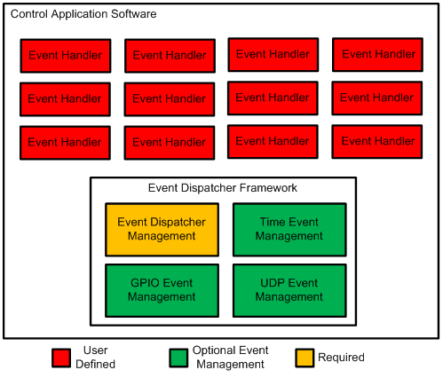

# Event-Dispatcher-Framework-Library
The purpose of the Event Dispatcher Framework Library is to provide a generic framework for developing specific purpose event driven control software.  This framework was written to have generic control functionality that can be extended by adding user code. An event dispatcher framework based application using this library is a made up of a collection of user defined event handlers which are managed by the Event Dispatcher Framework library, together forming an event driven application as shown below:

The framework was first developed for use in embedded system based hardware projects designed and built by students; therefore it was designed with simplicity in mind.  It is also cross platform and may be implementing on extremely resource constrained systems.  The framework is provided for free as an open source library for any purpose under a BSD like License.    
